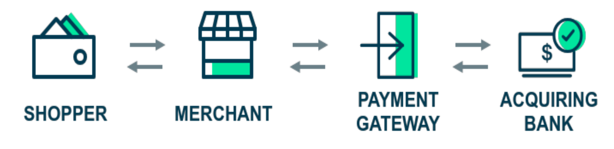
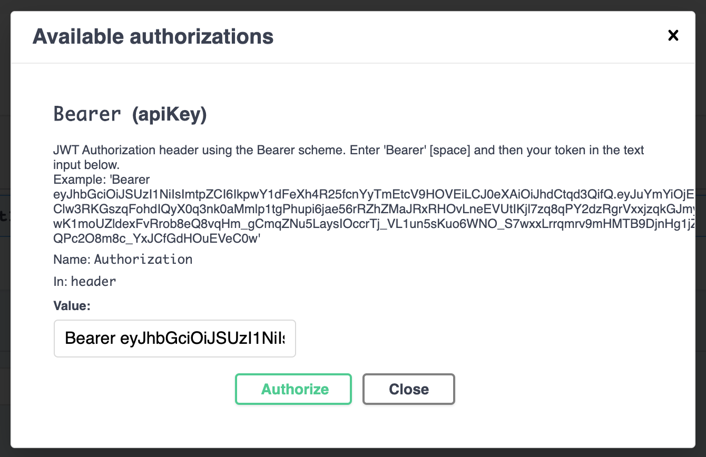
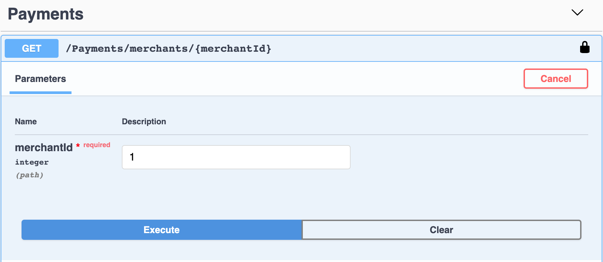
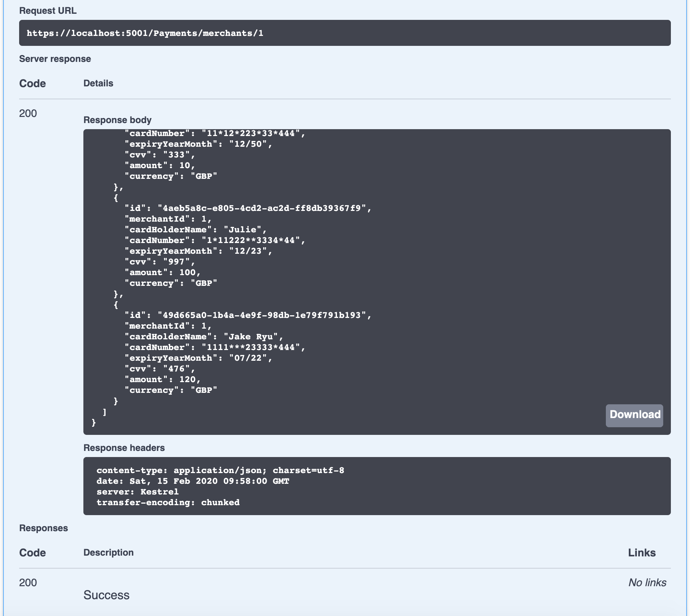
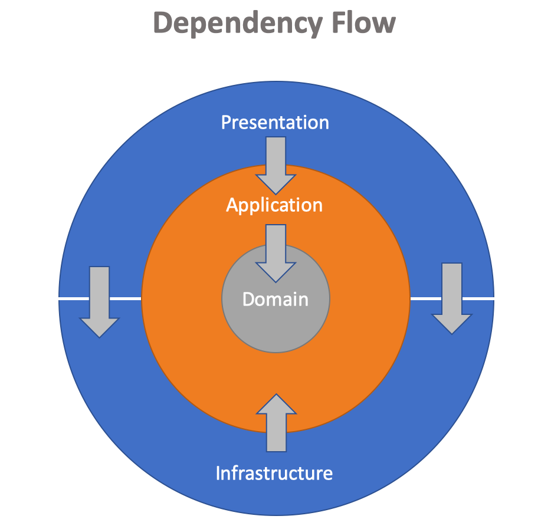
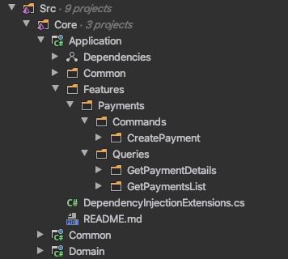
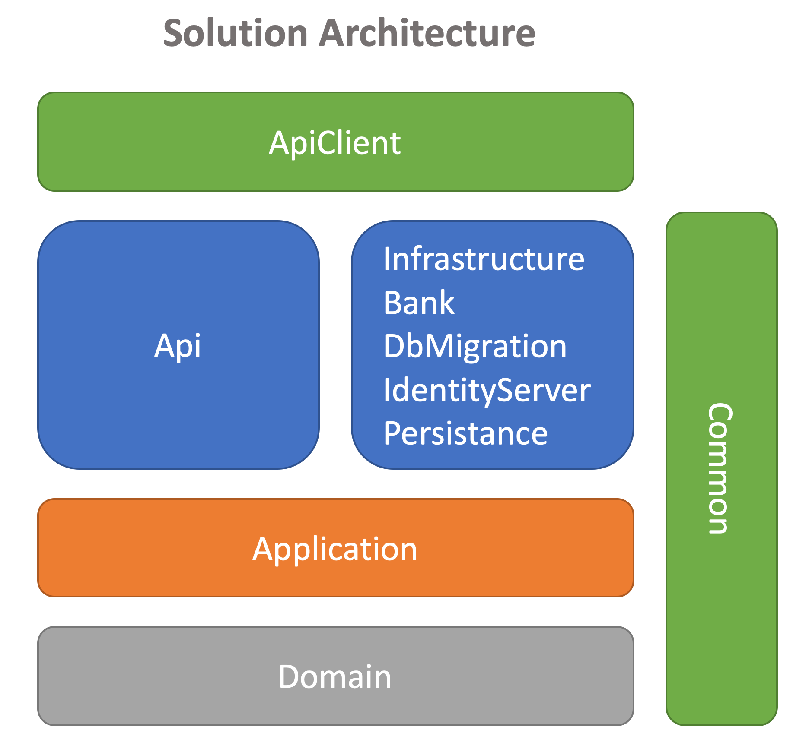

# Payment Gateway

E-Commerce is experiencing exponential growth and merchants who sell their goods or services online need a way to easily collect money from their customers.
The payment gateway will need to provide merchants with a way to process a payment. To do this, the merchant should be able to submit a request 
to the payment gateway. A payment request should include appropriate fields such as the card number, expiry month/date, amount, currency, and cvv.



### Development Scope

Build an API that allows a merchant to process a payment through the payment gateway, and to retrieve details of a previously made payment.

### How to run
The target framework is netcoreapp3.0. To run the solution, download and install .NET Core SDK v3.0.0 or later at https://dotnet.microsoft.com/download/dotnet-core/3.0
PowerShell is also required.
 
 Open PowerShell as administrator as writing permission is needed for a local database and logging. For MacOS, run 
 ```
 sudo pwsh
 ```
 
 Change directory to `Build` and run 
 ```
 ./build.ps1
 ``` 
 
 It invokes,
 
 1. Build the entire solution
 2. Migrate database
 3. Run test projects
 4. If the tests pass, run API
 
The API is listening on http://localhost:5000, https://localhost:5001
 
Note: If run into a permission error like "Can't write to SQLite ...", make sure the terminal is run as Admin privilege.

### Give it a try
The API are up and running if you have run the PowerShell script `build.ps1`. The script does not necessarily run the API but running tests before launching API is the idea.

Once API Swagger is loaded, we need a bearer token, otherwise we get 401 Unauthorised error. To do so, we need to launch IdentityServer to get a token.

- Open a new terminal window. Change director to `IdentityServer` and run
```
dotnet run
``` 

- Open a new terminal window. Change directory to `ApiClient` and run
```
dotnet run
``` 


Copy the value of access_token and put it in Swagger. Hit Authorize button on the top right in Swagger.

Enter the value copied with 'Bearer ' in front. Make sure the Bearer and the token are separated by space as below.

 

Hit Authorise button to close the dialog.

Let's post a payment request. Note that card number, `1111222233334444` is only accepted. Try other number to see if it returns `Bad Request` error.


Finally, we can see the list of payment. Provide the merchant number that was used on posting.




Note that the card number has been masked for security.

# Dependency rules in the architecture
The model of the solution is based on Clean Architecture and CQRS. 
The concentric circles in [Figure 1] represent different areas of software. The inner circles are policies; the outer circles are mechanism. The further in you go, the higher level the software becomes, in general.

[Figure 1]



*Source code dependencies must point only inward, toward higher-level policies.*

By separating the software into layers and conforming to the dependency rules, a system becomes intrinsically testable.


- Domain contains entities, value objects, enterprise-wide logic and exceptions
- Application contains interfaces to implement use case scenarios, command / queries, validators, exceptions
- Infrastructure contains all external concerns
- Presentation and Infrastructure depend only on Application
- Infrastructure and Presentation components can be replaced with minimal effort

# Application layer and  CQRS
Application layer is for use case scenarios to be implemented. The CQRS structure in [Figure 2] shows clear messages of the application purpose. 

[Figure 2] - CQRS Folder Structure



Having interfaces declared in Application conforms to the inversion of control. It makes it easy to replace external resource (dependency). [Figure 3] shows an example of creating a payment. 

[Figure 3]


Handler acquires a bank client through a bank client factory to send a payment request to a bank. If it is successful, it saves the payment details using the application-db-context.
Note that Handler works with interfaces. 

Looking at arrows indicating the use of interfaces, nothing in Application knows anything about something in an outside world except Domain.

# Solution Architecture

[Figure 4]



| Project        | Description           | Project Dependencies |
| ------------- |-------------|-------------|
| ApiClient     | A test tool to demonstrate how to get a bearer token form IdentityServer and use it to call API | - |
| Api     | Payment gateway API      | Application, Bank, Common, Infrastructure, Persistence |
| Infrastructure | Contains MachineDateTime implementation of IDateTime from Common project. Contains API client, file system, email/sms, system clock    | Application, Common |
| Bank | Collection of bank clients. Bank simulator mocks a bank for the sake of test | Application |
| DbMigration | Control database schema explicitly usnig FluentMigrator / Run by a build script | - |
| IdentityServer | Issue a bearer token to secure API | - |
| Persistence | Operate CRUD on database. Contains DbContext, configurations, seeding | Application |
| Application | Contain interfaces, models, logic, commands / queries, validators, exceptions | Common, Domain |
| Domain | Contain entity, value object, enum, exception, logic | Common |
| Common | Cross cutting concerns like date time service, logging, etc | - |

# What makes a good application

### Application logging
Serilog is a choice of logging here. For the test purpose it logs in a file but adding another sink for test and production
environment. It's extremely useful to use a centralised logging. Using a correlation id such as user id to group sequential processes helps track a user journey.
The log files are found in `Logs` directory under the solution root.

MediatR handles all requests and manages the request pipeline. We can log all requests and its performance via MediatR. Refer Application > Common > Behaviors.

### Application metrics

### Containerisation

### Authentication

IdentityServer 4

### API Client

### Build script / CI

PSake

### Performance testing

### Encryption

### Data Storage

SQLite

